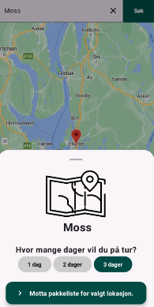
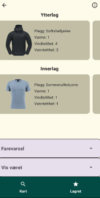

This application was made in collaboration with the University of Oslo in the course: IN2000 - Software engineering med prosjektarbeid and Meterologisk institutt.

In the spring semester of 2023, six students created this application.
The app's main goal is to recommend to the user, what hike clothes to wear based on the weather.

To achieve this, the app uses APIs from Meterologisk institutt, and Google.

The user can select a place in the world:

And then receive a list of recommended clothes to bring

